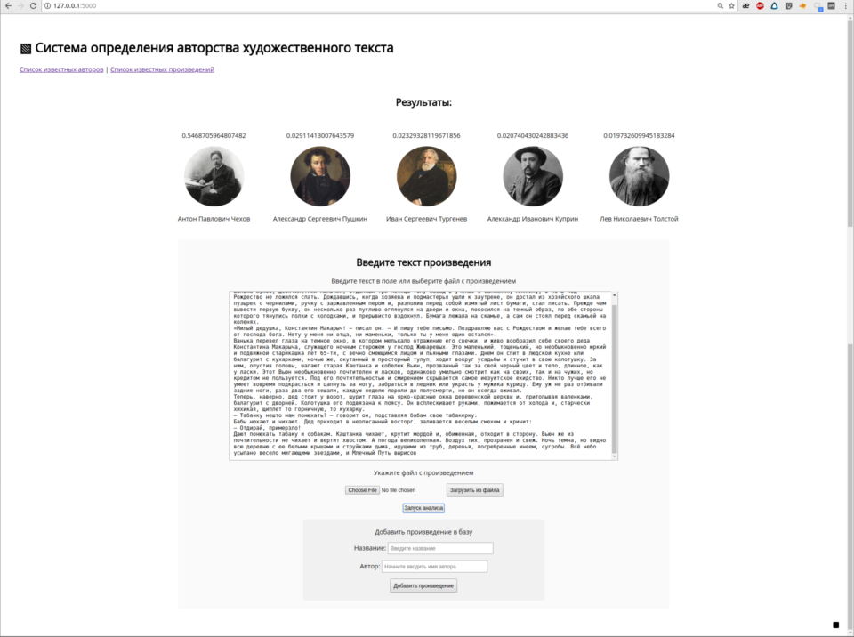
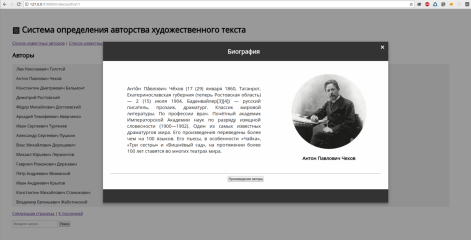

## Определение авторства художественного текста

Веб-сервис для  атрибуции фрагментов художественных текстов на основе модели рекуррентной нейронной сети и данных открытых электронных библиотек. 

#### Язык:
  - Python 3.6

#### Основные библиотеки :
  - Flask
  
Обучение:
  - Keras(TensorFlow)
  - Scikit learn
  
Сбор данных:
  - Grab

Препроцессинг
  - Mystem
  - Pandas
  - NumPy

#### Источники данных:
  - loveread.ec 
  - ru.wikisource.org
  
_________

[Модуль 2](https://github.com/JointEntropy/author_identification2)
